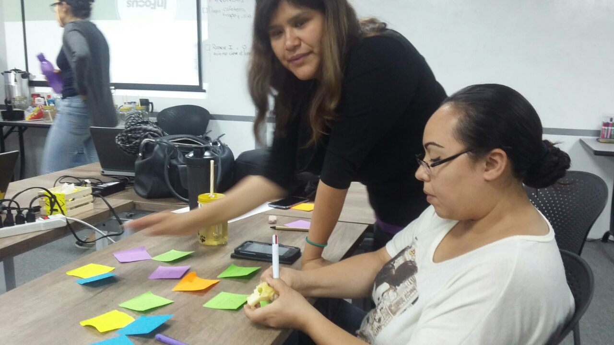
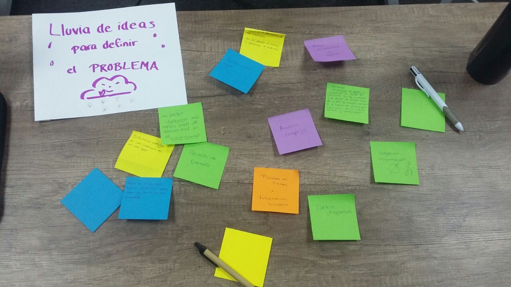
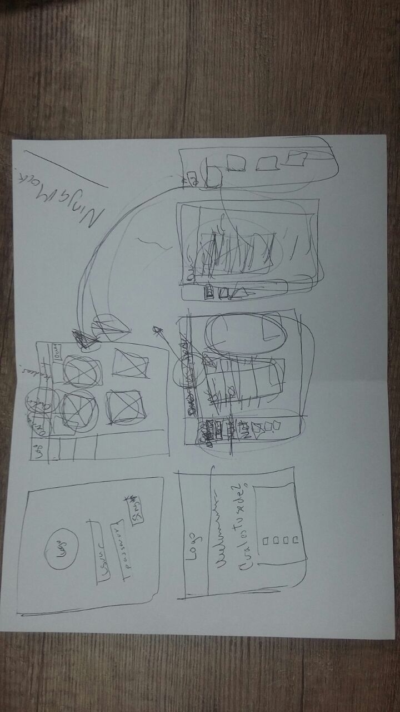
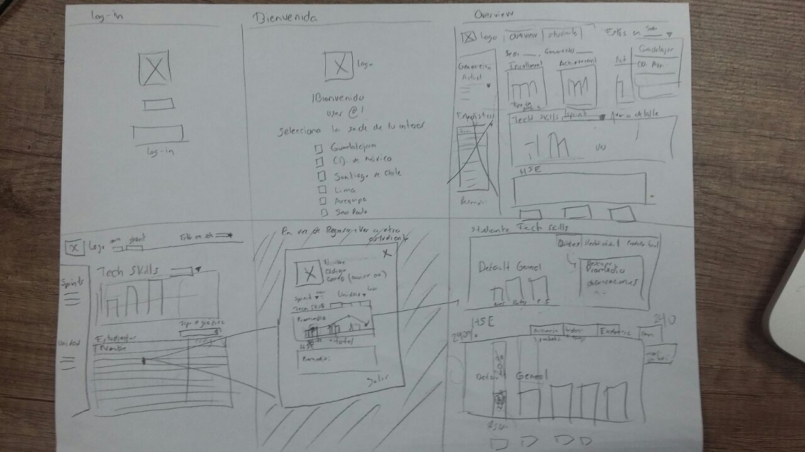
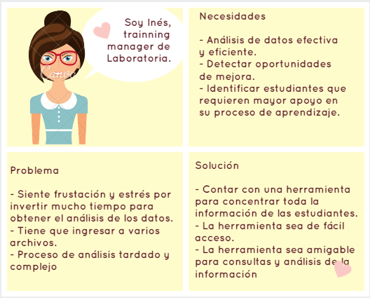

# Data Dashboard

* **Track:** _Common Core_
* **Curso:** _Creando tu primer sitio web interactivo_
* **Unidad:** _Producto final_

***

## INTRODUCCION

Las Training Managers (TMs) de Laboratoria tienen como función identificar las necesidades de capacitación y entrenamiento actuales y futuras de las estudiantes, así como la evaluación continua del rendimiento, desempeño, funcionamiento y ejecución de los planes de entrenamiento a lo largo de todo el proceso de capacitación.

Para cumplir tales propósitos, actualmente las TMs se ven en la necesidad de generar y consultar múltiples archivos de excel localizados en distintas carpetas y ubicaciones, lo que les hace perder tiempo localizando estos documentos y filtrando información a través de la ejecución de fórmulas para obtener los datos que necesitan, esto les genera estrés y frustración, y volviendo necesaria la creación de una herramienta donde puedan consultar estos datos fácil y rápidamente.

## INVESTIGACIÓN Y EMPATÍA

### Metodología
La metodología para alcanzar los objetivos del producto se divide en el uso de los siguientes métodos específicos:

* **Entrevistas/encuestas a clientes** Se realizaron Entrevistas personales a TM y facilitadores del bootcamp al que tenemos acceso (Laboratoria GDL), en el caso de los Bootcamps foraneos se mandaron encuestas, en este caso, solo a las TM de los Bootcamps de Ciudad de México, Lima, Perú y Santiago de Chile en las que se especificaron preguntas para definir las áreas de oportunidad de los medios actuales en los que se apoyan, guardando y consultando información de las estudiantes.
* **Resultado de entrevistas** Estos fueron casi homogéneos ya que las TM coincidían en que utilizan hojas de excel vínculadas a la nube y son descentralizadas, es decir, que la información no está vinculada, no está consolidada y les hace perder tiempo, así cómo espacio en la nube, ya que tardan mucho en analizar y recabar la información que a diario requieren y que actualizan cada sprint.
* **Mención de descubrimientos** requieren un sistema que les permita obtener el porcentaje de estudiantes por arriba y debajo del 70% de calificación, así cómo el resultado de los self assessment, feedback de final de proyecto, evaluaciones técnicas de retos y productos finales y HSE.
Mencionan que las gráficas son buena herramienta para hacer comparativos visuales acerca de desempeño y alcances, en los que se resuma la información.

## DEFINICIÓN

### Hipótesis sobre información obtenida
La creación de un dashboard como herramienta web permitirá tener compilada la información de todas las sedes de Laboratoria en un solo lugar facilitando el manejo eficaz y eficiente de los datos requeridos por las TMs para lograr un análisis óptimo que permita detectar con prontitud las oportunidades de mejora y agilizar la implementación de estrategias para alcanzar los objetivos de entrenamiento y capacitación de las estudiantes de Laboratoria.

### Definición del problema principal
Las Training Managers no cuentan con una herramienta que concentre toda la información de las estudiantes que sea de fácil acceso para su consulta y análisis.

### Objetivos
El objetivo principal de este producto es crear una herramienta web para visualizar los siguientes datos de forma rápida y sencilla:

1. El total de estudiantes presentes por sede y generación.
2. El porcentaje de deserción de estudiantes.
3. La cantidad de estudiantes que superan la meta de puntos en promedio de todos los sprints cursados. La meta de puntos es 70% del total de puntos en HSE y en tech.
4. El porcentaje que representa el dato anterior en relación al total de estudiantes.
5. El Net Promoter Score (NPS) promedio de los sprints cursados.
6. Filtrar por estudiante el desempeño personal general y por unidad
7. Acceso a diferentes usuarios, incluso para las estudiantes, para generar retroalimentación diaria.

### Muestra de pruebas y resultados de lluvia de ideas para definir el problema
Proceso de brainstorming:

Lluvia de ideas:

## IDEACIÓN
### Muestra de pruebas y resultados de lluvia de ideas para definir

Primer prototipo:

Segundo prototipo:

## SKETCHING & PROTOTYPING  

### Persona ###

  
### Historia del usuario

### Sketch de flujo de aplicación
